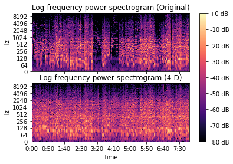

# IVDM -- 4-Dimensional Music

We listen to music in one order -- from start to finish. This program makes music that at any moment, you can hear parts of a song, from the beginning to the end, all at once. IVDM lets you enjoy music not sequentially but as a whole. The music created can be looped seamlessly, making a cycle where the beginning and end can be anywhere. A 4-minute song is no longer 4-minute, but it is at the same time always 4-minute.

## Requirements
- `librosa`
- `soundfile`
- `numpy`
- `scipy`

## How it works

IVDM analyses the tempo of a piece of music and divides it into segments spanning a specified number of beats. These segments are each repeated to the length of the original piece of music. The volume of each repetition is adjusted so that it is loudest at the time that segment originally comes from. Finally, all these looped segments are combined and the 4-Dimensional song is made.

IVDM works with audio files that have one to two channels and uses the sources' sampling rates.

Example using Rhapsody in Blue by George Gershwin:  

## Usage

Usage:  
   -  `ivdm.py <input> <output> <segment_length>`
    
Usage (Windows):  
   -  `python3 ivdm.py <input> <output> <segment_length>`
    
Options:  
   -  `<input>`             Input audio file.  
   -  `<output>`            Output audio file. WAV is recommended.  
                          For all available formats, see `soundfile.available_formats()`  
                          Default is `./ivdm_out.wav`  
   -  `<segment_length>`    Length of segments used in making 4-D music. Measured in the number of beats.  
                        Default is `32`. Longer sengment lengths give cleaner music that resembles the  
                        input more. Shorter segment lengths give music with more sounds at any moment.  
   -  `-h`                  Show this message.  
    
Examples:  
   -  `ivdm.py ./music.wav`  
   -  `ivdm.py ./music2.mp3 ./musictwo.wav 64`  
    
Examples (Windows):  
   -  `python3 ivdm.py ./music.wav`  
   -  `python3 ivdm.py ./music2.mp3 ./musictwo.wav 64`  
